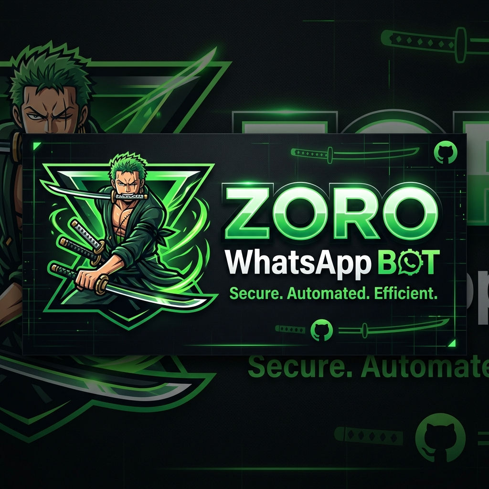
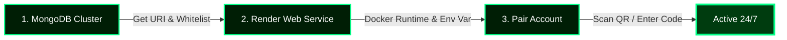

<div align="center">
  <!-- Glowing Wavy Header Banner -->
  

  <!-- Premium Zoro Rounded Avatar with Neon Border Shadow -->
  

  <br><br>

  <!-- Animated Typing Heading -->
  <h1 align="center">
    
  </h1>

  <p align="center">
    <strong>An ultra-performance, vibrant, and modular WhatsApp automation engine powered by Node.js, Baileys, and MongoDB.</strong>
  </p>

  <!-- Custom HSL Neon Badges -->
  <p align="center">
    
    
    
    
    
  </p>
</div>

<br>

---

## 🍃 Features At A Glance

| Capabilities       | Technical Implementation                                    | Platform Advantage                                     |
| :----------------- | :---------------------------------------------------------- | :----------------------------------------------------- |
| 📱 **Dashboard**   | Glassmorphic local web server interface on port `3000`      | Dual-mode QR code and phone number pairing             |
| 💾 **Persistence** | Persistent session state serialization via MongoDB Atlas    | Zero disconnections, infinite container lifespan      |
| ⚡ **Streams**     | Multi-instance Cobalt v7 API routing engine                 | 0% CPU & container RAM overhead during downloads       |
| 🎬 **Graphics**     | Automatic multi-stage FFmpeg conversion pipelines           | 240FPS slow-motion and fluid video interpolation       |
| 🤖 **AI Engine**    | Direct integrations with OpenAI ChatGPT & Thena models      | High-fidelity image synthesis and smart chats          |

---

## 🐍 Dynamic Command Suite

Wake Zoro up using the command prefixes: `.`, `/`, or `!` ⚔️

### 🎬 1. Media Downloader Suite
*Fast, optimized streams powered by Cobalt & SnapInsta fallback.*

| Command           | Description                                                  | Usage Example                                          |
| :---------------- | :----------------------------------------------------------- | :----------------------------------------------------- |
| 📸 **`.insta`**   | Download Instagram Reels, Posts, Carousel images & videos    | `.insta <instagram-url>`                               |
| 🎵 **`.tiktok`**  | Download TikTok videos (with picker support for slide shows) | `.tiktok <tiktok-url>`                                 |
| 📺 **`.video`**   | Search or download YouTube video in high resolution          | `.video <url or query>`                                |
| 🎧 **`.music`**   | Search or extract YouTube music/audio stream                 | `.music <url or query>`                                |
| 🖼️ **`.wp`**      | Fetch and download high-resolution wallpapers                | `.wp Roronoa Zoro`                                     |
| 👁️ **`.show`**    | Intercept and reveal WhatsApp "View Once" media files         | *Reply to a View Once message* with `.show`            |

---

### 🎨 2. Sticker & Graphics Lab
*Advanced webp rendering & sticker conversion.*

| Command           | Description                                                  | Usage Example                                          |
| :---------------- | :----------------------------------------------------------- | :----------------------------------------------------- |
| 🖼️ **`.sticker`**  | Convert static/animated image, video, or GIF into a sticker  | *Reply to image/video* with `.sticker`                 |
| 🔄 **`.vsticker`** | Extract and convert animated stickers back into MP4 videos    | *Reply to sticker* with `.vsticker`                    |
| 🔠 **`.attp`**     | Generate dynamic, rainbow animated text-to-stickers          | `.attp Zoro`                                           |
| 💬 **`.q`**        | Convert messages into elegant quotes formatted as stickers   | *Reply to message* with `.q -cyan`                      |
| 👤 **`.avatar`**   | Generate random high-resolution DiceBear avatars             | `.avatar`                                              |

---

### 🧠 3. Artificial Intelligence & Generative
*Advanced LLMs and Image Synthesis.*

| Command           | Description                                                  | Usage Example                                          |
| :---------------- | :----------------------------------------------------------- | :----------------------------------------------------- |
| 🤖 **`.chatgpt`**  | Start/continue an intelligent conversational session          | `.chatgpt Who is Roronoa Zoro?`                        |
| 🌌 **`.dream`**    | Synthesize high-fidelity images via Thena AI model           | `.dream samurai zoro in neon cyberpunk city`           |
| 🖼️ **`.thisx`**    | Synthesize realistic assets using "This X Does Not Exist"    | `.thisx person`                                        |
| 🎬 **`.lyrics`**   | Search and fetch complete song lyrics                        | `.lyrics Starboy`                                      |

---

### 🛡️ 4. Group Moderation & Control
*Granular group management utilities.*

| Command           | Description                                                  | Usage Example                                          |
| :---------------- | :----------------------------------------------------------- | :----------------------------------------------------- |
| 🤫 **`.mute`**     | Restrict sending messages in a group chat to admins only     | `.mute 3 h` (Mute for 3 hours)                         |
| 🔊 **`.unmute`**   | Unlock group messaging for all members                       | `.unmute`                                              |
| ➕ **`.add`**      | Add a user directly to the group                             | `.add 1234567890`                                      |
| ⛔ **`.ban`**      | Remove a user from the group                                 | `.ban` (*or reply to user*)                            |
| 👑 **`.promote`**  | Promote a group member to Admin status                       | `.promote` (*or reply to user*)                         |
| 📉 **`.demote`**   | Remove Admin privileges from a member                        | `.demote` (*or reply to user*)                         |
| 🔇 **`.gmute`**    | Globally mute a user across all mutual group chats           | *Reply to user* with `.gmute`                           |
| 🔊 **`.ungmute`**  | Remove global mute restriction from a user                   | *Reply to user* with `.ungmute`                         |
| 📣 **`.tagall`**   | Mention every single member in the group chat                | `.tagall Wake up!`                                     |
| 👔 **`.tagadmin`** | Tag only the group admins                                    | `.tagadmin Need assistance!`                           |
| 🚫 **`.blacklist`**| Globally ban a user or group from interacting with Zoro       | `.blacklist add 1234567890`                            |

---

### ⚙️ 5. System Utilities & Dev Commands
*Power controls for Bot Owners and Sudo users.*

| Command           | Description                                                  | Usage Example                                          |
| :---------------- | :----------------------------------------------------------- | :----------------------------------------------------- |
| 🟢 **`.alive`**    | Display active server health, memory usage, and uptime status | `.alive`                                               |
| 🎛️ **`.worktype`** | Toggle global mode between `public` or `private`             | `.worktype private`                                    |
| 👤 **`.sudo`**     | View, add, or revoke full sudo privileges to users            | `.sudo add 1234567890`                                 |
| 🔄 **`.update`**   | Pull and synchronize code changes with origin git repository | `.update now`                                          |
| 🛠️ **`.edit`**     | Realtime modification of alive, afk, welcome, and goodbye texts| `.edit welcome Welcome to the Crew! ⚔️`                 |
| 📡 **`.ping`**     | Measure the bot's response and message processing latency    | `.ping`                                                |
| 🔌 **`.plugin`**   | Search, install, or manage dynamic extensions                | `.plugin list`                                         |
| 🌐 **`.ss`**       | Capture high-fidelity screenshots of any webpage             | `.ss google.com`                                       |
| 🔗 **`.shorten`**  | Shorten URLs and track click statistics/analytics            | `.shorten https://github.com`                          |
| 💬 **`.filter`**   | Set automated keyword triggers and responses                 | `.filter hi -> hello!`                                 |

---

### 🎲 6. Entertainment & Gaming Suite
*Interactive modules for engagement.*

| Command           | Description                                                  | Usage Example                                          |
| :---------------- | :----------------------------------------------------------- | :----------------------------------------------------- |
| 🃏 **`.blackjack`**| Play a complete interactive game of Blackjack in chat        | `.blackjack`                                           |
| 🎮 **`.gamefps`**  | Check system specs & average FPS/requirements for any PC game| `.gamefps Cyberpunk 2077`                              |
| 🍿 **`.imdb`**     | Retrieve ratings, plot outline, and actor cast for movies    | `.imdb Inception`                                      |
| 🎥 **`.slowmo`**   | Interpolate video frame-rates up to 240FPS                   | *Reply to video* with `.slowmo quality`                 |
| 🔄 **`.interp`**   | Make video movement smoother using frame-interpolation       | *Reply to video* with `.interp quality`                 |

---

<br>

## 🚀 Cloud Deployment (Highly Recommended)

> [!TIP]
> **Free 24/7 Premium Uptime & Keep-Alive** 🕒
> Running Zoro on Render with MongoDB Atlas ensures persistent session storage (never scan the QR code twice).
> 
> Zoro has a **built-in keep-alive self-pinging mechanism** that automatically reads the `RENDER_EXTERNAL_URL` environment variable (injected by Render) and pings itself every 5 minutes to prevent the Render container from sleeping/going offline.
>
> If you notice any lag or connection issues, you can also use a free third-party pinging service like **[cron-job.org](https://cron-job.org/)** or **[UptimeRobot](https://uptimerobot.com/)** configured to ping your Render URL (`https://your-app-name.onrender.com/`) every 5 minutes. This ensures the service stays active 24/7.

### 🗺️ Visual Setup Pipeline



### ⚙️ Quick Start Steps

| Stage | Platform / Dashboard | Actions & Instructions | Key Settings |
| :--- | :--- | :--- | :--- |
| **Step 1** | [MongoDB Atlas](https://www.mongodb.com/atlas) | Create a free database cluster & whitelist IP `0.0.0.0/0` | Copy MongoDB URI string |
| **Step 2** | [Render](https://render.com/) | Link this repository and spin up a new **Web Service** | Set **Runtime** to `Docker` |
| **Step 3** | [Render Environment](https://dashboard.render.com/) | Add your environment variables in the settings tab | Add `MONGODB_URI` = *copied URI* |
| **Step 4** | [Web Interface](http://localhost:3000) | Open your Render service URL (or localhost:3000) in a browser tab | Authenticate by scanning the QR code |

---

## 💻 Local Installation

> [!IMPORTANT]
> Requires **Node.js (v22+)** and **FFmpeg** installed on your system.

```bash
# 1. Clone the repository
git clone https://github.com/Alinshan/Zoro.git

# 2. Enter directory
cd Zoro

# 3. Install dependencies
npm install

# 4. Start the bot
npm start
```
*Access `http://localhost:3000` in your web browser to scan the QR code and link your WhatsApp account. The session will automatically save to your MongoDB database for future starts.*

---

<div align="center">
  <!-- Glowing Wavy Footer Banner -->
  
  
  <br>
  <b>Forged with 💚 and ⚔️ by <a href="https://github.com/Alinshan">Alinshan</a></b>
  <br><br>
</div>
